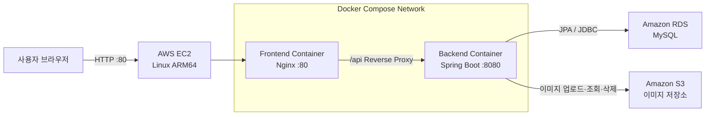
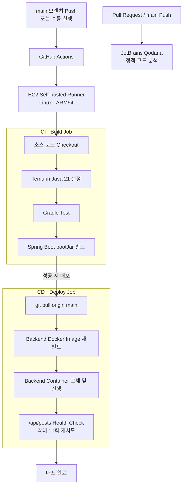
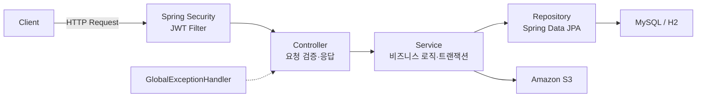

# 구장 이야기 ⚾️

<br />

## 프로젝트 소개

- KBO 야구 팬들을 위한 `정보 공유 커뮤니티` 프로젝트입니다.
- 야구장 근처 핫플과 맛집 정보를 공유하고, 경기 응원 및 팬들 사이의 소통을 주목적으로 합니다.
- 매달 새로운 주제로 인기 구장을 투표하고 실시간 TOP3 랭킹을 제공합니다.

**프로젝트 홈페이지:** [구장 이야기 ⚾️](http://43.201.58.221/)

<br />

## BE 소개

- Spring Boot 기반 REST API 서버로 회원, 게시글, 댓글, 좋아요, 구장 투표 기능을 제공합니다.
- Spring Security와 JWT를 사용해 Stateless 인증 및 인가를 처리합니다.
- Spring Data JPA로 데이터를 관리하고, 운영 환경에서는 Amazon RDS for MySQL을 사용합니다.
- 게시글 및 프로필 이미지는 Amazon S3에 저장하고 Presigned URL로 안전하게 제공합니다.
- 서비스 계층에서 작성자 검증, 비밀번호 암호화, 중복 투표 및 좋아요 방지 등의 비즈니스 규칙을 처리합니다.

<br />

## 개발 인원 및 기간

- 개발 기간: 2026.06.25 ~ 현재
- 개발 인원: FE/BE 1명

<br />

## 사용 기술 및 Tools

### Backend

<p>
  
  
  
  
  
  
</p>

### Database & Storage

<p>
  
  
  
  
</p>

### Test & Code Quality

<p>
  
  
  
</p>

### Deployment & Collaboration

<p>
  
  
  
  
  
</p>

<br />

## 배포 구조

<details>
<summary>배포 구조 보기</summary>



- 프론트엔드 Nginx가 `/api` 요청을 Spring Boot 컨테이너의 `8080` 포트로 전달합니다.
- Spring Boot 서버는 운영 환경에서 Amazon RDS for MySQL에 연결합니다.
- 프로필 및 게시글 이미지는 Amazon S3에 저장하고 Presigned URL로 제공합니다.
- 애플리케이션은 Docker 이미지로 빌드되어 EC2의 Docker Compose 환경에서 실행됩니다.

</details>

<br />

## CI/CD 구조

<details>
<summary>CI/CD 구조 보기</summary>



1. `main` 브랜치에 Push하거나 워크플로를 수동 실행하면 CI/CD가 시작됩니다.
2. Java 21 환경에서 Gradle 테스트를 실행하고 실행 가능한 JAR를 빌드합니다.
3. CI가 성공하면 서버 소스를 갱신하고 백엔드 Docker 이미지를 다시 빌드합니다.
4. 기존 백엔드 컨테이너를 교체한 뒤 `/api/posts` 요청으로 정상 동작을 검증합니다.
5. Pull Request와 `main` Push에는 Qodana 정적 코드 분석도 별도로 실행됩니다.

</details>

<br />

## 폴더 구조

<details>
<summary>프로젝트 폴더 구조 보기</summary>

```text
KTB-WEEK04/
├── .github/
│   └── workflows/                    # CI/CD 및 Qodana 워크플로
├── springboot/
│   ├── src/
│   │   ├── main/
│   │   │   ├── java/ktb/week04/springboot/
│   │   │   │   ├── config/           # Security, S3 설정
│   │   │   │   ├── controller/       # REST API 엔드포인트
│   │   │   │   ├── dto/              # 요청·응답 DTO
│   │   │   │   ├── entity/           # JPA 엔티티 및 복합키
│   │   │   │   ├── exception/        # 전역 예외 처리
│   │   │   │   ├── repository/       # JPA Repository
│   │   │   │   ├── security/         # JWT 인증·인가
│   │   │   │   ├── service/          # 비즈니스 로직
│   │   │   │   └── SpringbootApplication.java
│   │   │   └── resources/
│   │   │       ├── application.yaml
│   │   │       ├── application-local.yaml
│   │   │       └── application-prod.yaml
│   │   └── test/                      # 단위·통합·동시성 테스트
│   ├── Dockerfile
│   ├── build.gradle
│   ├── settings.gradle
│   ├── gradlew
│   └── gradlew.bat
├── qodana.yaml
└── README.md
```

</details>

<br />

## FE 레포

[GitHub - yuyoung02/KTB-WEEK10](https://github.com/yuyoung02/KTB-WEEK10)

<br />

## 서비스 시연 영상

<a href="https://youtu.be/fr_ECn_Xj0U">
  
</a>

[▶️ 구장 이야기 서비스 시연 영상 보기](https://youtu.be/fr_ECn_Xj0U)

<br />

## 서버 설계

### 서버 구조

<details>
<summary>서버 구조 보기</summary>



| 계층 | 역할 |
| :--- | :--- |
| Security | JWT 검증, 인증 객체 생성, 공개·보호 API 접근 제어 |
| Controller | HTTP 요청 수신, 입력값 검증, DTO 기반 응답 반환 |
| Service | 핵심 비즈니스 규칙, 권한 검증, 트랜잭션 처리 |
| Repository | Spring Data JPA 기반 데이터 접근 |
| Entity | 사용자, 게시글, 댓글, 좋아요, 구장 투표 도메인 표현 |
| External Storage | S3 이미지 업로드·삭제 및 Presigned URL 발급 |

</details>

### 구현 기능

<details>
<summary>구현 기능 보기</summary>

| 도메인 | 구현 기능 |
| :--- | :--- |
| 회원/인증 | 회원가입, 로그인, JWT 발급·검증, BCrypt 비밀번호 암호화 |
| 마이페이지 | 내 정보 조회·수정, 프로필 이미지 관리, 비밀번호 변경, 회원 탈퇴 |
| 게시글 | 작성, 목록·상세 조회, 수정, 삭제, 조회수 처리 |
| 검색/필터 | 제목·본문 키워드 검색, 구장별 필터, 검색과 구장 필터 조합 |
| 댓글 | 게시글별 댓글 작성·조회·수정·삭제, 작성자 권한 검증 |
| 좋아요 | 게시글 좋아요 등록·취소·상태 조회, 사용자별 중복 방지 |
| 구장 투표 | 월별 구장 투표 등록·변경·취소, 내 투표 조회 |
| 구장 랭킹 | 월별 투표 결과 집계 및 TOP3 랭킹 제공 |
| 이미지 | S3 업로드·삭제, 프로필·게시글 이미지 Presigned URL 제공 |
| 예외 처리 | 전역 예외 응답, 인증 실패 및 잘못된 비밀번호 처리 |
| 테스트 | 서비스 단위 테스트, MySQL Testcontainers 통합·동시성 테스트 |

</details>

<br />

## 데이터베이스 설계

> TODO: ERD 이미지와 테이블별 상세 설명을 추가할 예정입니다.
